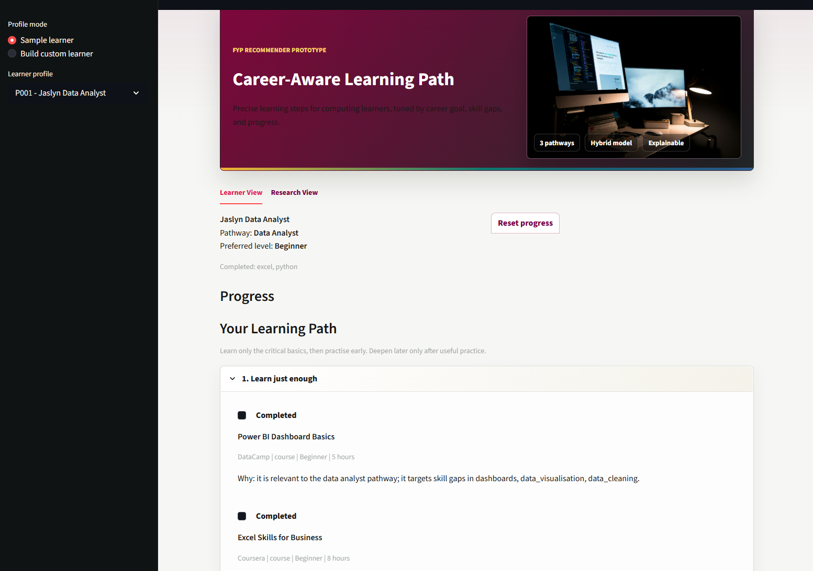
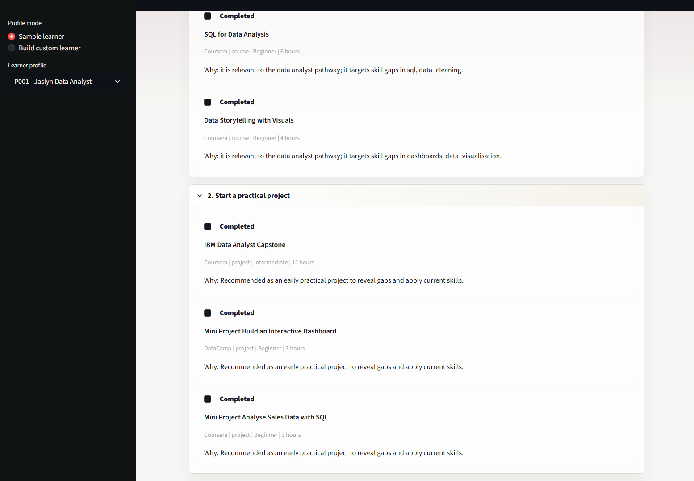
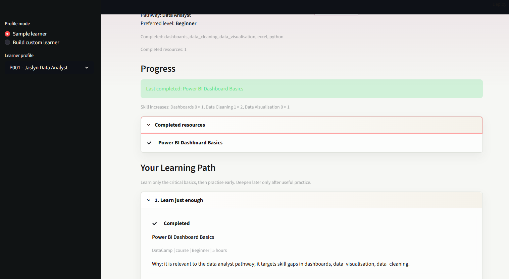
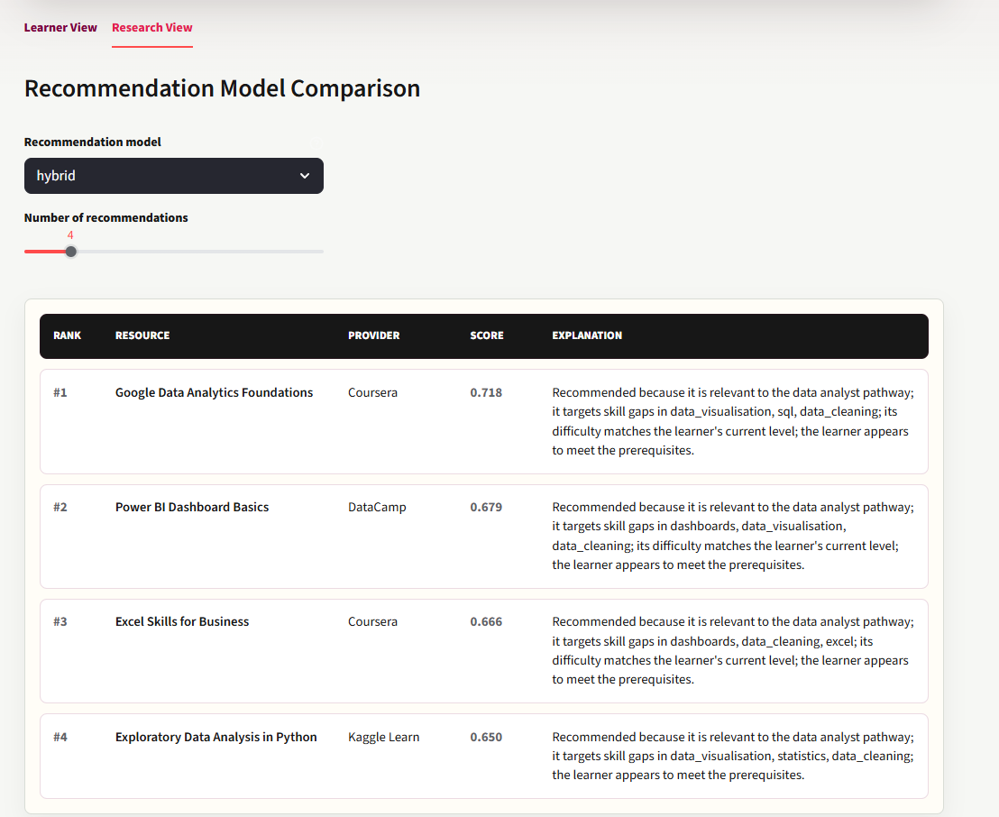
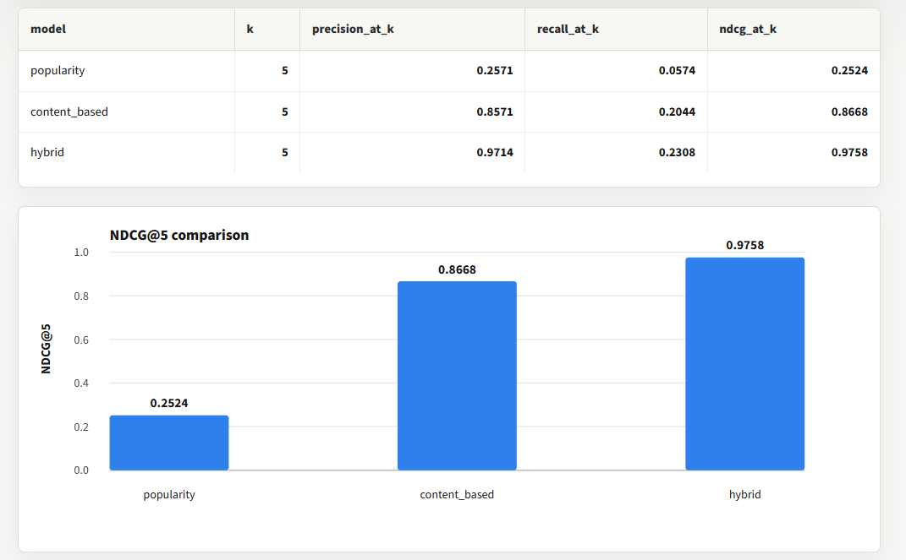
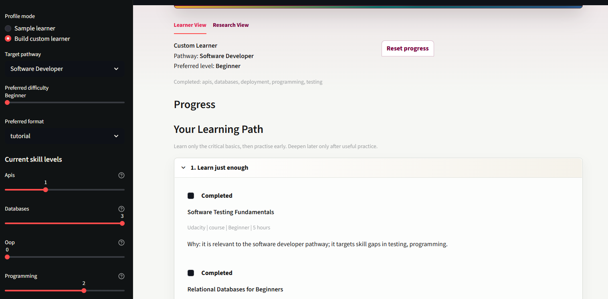

# Appendix D: Prototype Screenshots

This appendix contains screenshots of the Streamlit feature prototype.

## Figure D.1: Learner View

Shows the main learner-facing view with the selected profile, progress area, and staged learning path.

## Figure D.2: Start A Practical Project Stage

Shows the project-focused stage of the learning path.

## Figure D.3: Progress Update

Shows the completed-resource interaction and progress update after marking a recommendation as completed.

## Figure D.4: Research View Recommendations

Shows the Research View recommendation output with model selection and ranked recommendation explanations.

## Figure D.5: Research View Model Comparison

Shows the model comparison metrics and NDCG@5 chart.

## Figure D.6: Custom Learner Sidebar

Shows the custom learner controls for pathway, difficulty, format, and skill levels.

