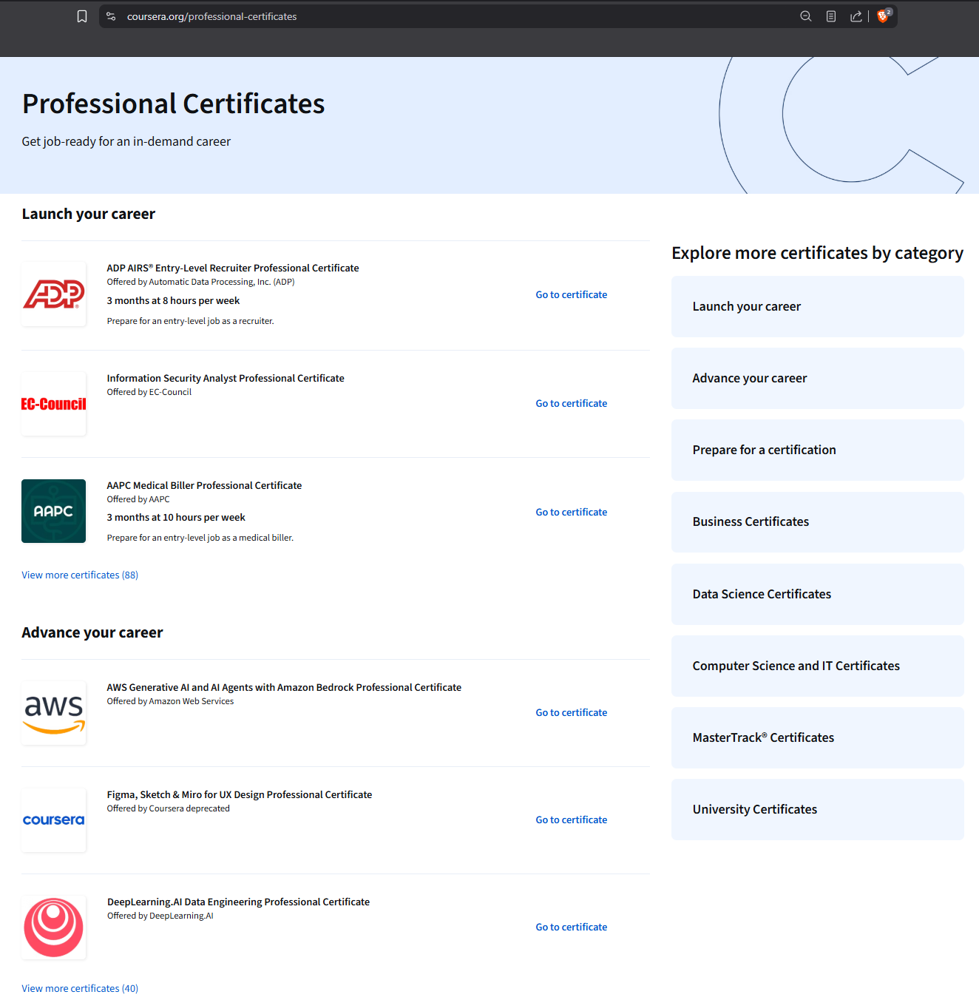
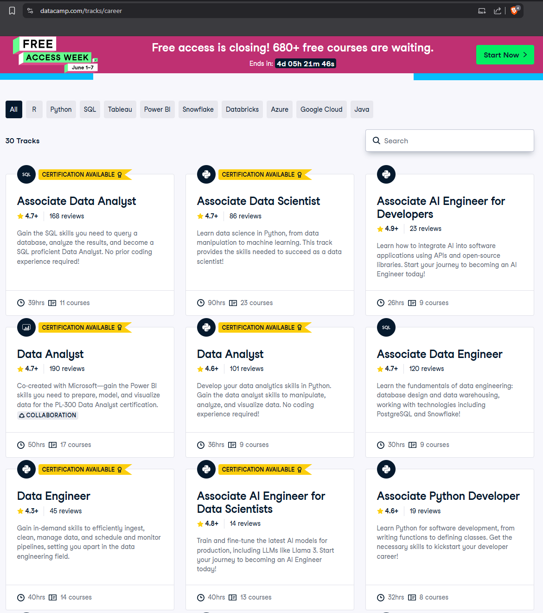
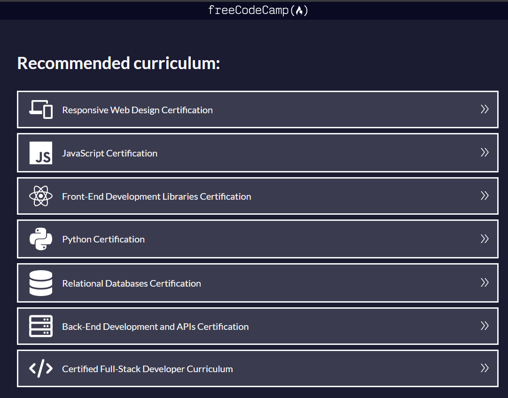

# UNIVERSITY OF LONDON INTERNATIONAL PROGRAMMES

# BSc Computer Science and Related Subjects

# CM3070 PROJECT

# PRELIMINARY PROJECT REPORT

# Career-Aware Educational Content Recommendation System

| Project Detail | Information |
|---|---|
| Author | Jaslyn Chan Yu Xin |
| Student Number | 240662387 |
| Date of Submission | 29 May 2026 |
| Supervisor | Chew Jee Loong |

## Contents

- [Chapter 1 Introduction](#chapter-1-introduction)
  - [1.1 Aim](#11-aim)
  - [1.2 Research Questions](#12-research-questions)
  - [1.3 Objectives And Deliverables](#13-objectives-and-deliverables)
- [Chapter 2 Literature Review](#chapter-2-literature-review)
- [Chapter 3 Project Design](#chapter-3-project-design)
  - [3.1 Domain And Users](#31-domain-and-users)
  - [3.2 User And Domain Requirements](#32-user-and-domain-requirements)
  - [3.3 Data Design](#33-data-design)
  - [3.4 Recommender Structure](#34-recommender-structure)
  - [3.5 Technologies And Methods](#35-technologies-and-methods)
  - [3.6 Work Plan](#36-work-plan)
  - [3.7 Testing And Evaluation Plan](#37-testing-and-evaluation-plan)
- [Chapter 4 Feature Prototype](#chapter-4-feature-prototype)
  - [4.1 Current Prototype Results](#41-current-prototype-results)
  - [4.2 Prototype Evaluation](#42-prototype-evaluation)
- [Appendices](#appendices)
- [References](#references)

# Chapter 1 Introduction

Computing learners can access large numbers of online courses, tutorials, projects, and career pathways from platforms such as Coursera, DataCamp, and freeCodeCamp (Coursera, n.d.; DataCamp, 2022; freeCodeCamp, 2014). This abundance is useful, but it can also make self-directed learning difficult. A learner who wants to become a Data Analyst, Machine Learning Engineer, or Software Developer may not need a full fixed career track immediately. They may need a precise next step that addresses a current skill gap, fits their present ability, and helps them start practical work early.

This project develops a career-aware educational content recommendation system for computing learners. The system uses a learner's target pathway, current skill levels, weak skills, completed topics, preferred difficulty, and learning-resource metadata to recommend a staged learning path. The project follows the template `1.1 Project Idea 1: Data-Driven Personalised Educational Content Recommendation`, and implements it as a data science recommender prototype rather than a full learning management system. The project focuses on recommendation logic, evaluation, and an explainable research demo.

The main idea is to avoid rigid full career tracks. Instead, the recommender supports a "learn just enough, start practical work, deepen later" approach. For example, an aspiring Data Analyst who already knows basic Python and Excel but has weak SQL and dashboard skills should receive targeted SQL, data cleaning, and visualisation resources before being shown broad optional career tracks.

## 1.1 Aim

The aim of the project is to design, implement, and evaluate an explainable career-aware educational content recommendation system for computing learners.

## 1.2 Research Questions

The project investigates the following questions:

1. How can learner profiles and career pathway requirements be represented so that skill gaps can be used in recommendation?
2. Can a hybrid recommender produce more relevant top-five learning-resource recommendations than a popularity baseline and a content-based recommender?
3. How can recommendation explanations make the suggested learning path more understandable to learners and evaluators?
4. Can a lightweight prototype demonstrate practical, staged learning guidance without becoming a full learning platform?

## 1.3 Objectives And Deliverables

The objectives and related deliverables are:

| Objective | Deliverable |
|---|---|
| Curate computing learning resources from multiple providers | `data/resources.csv` |
| Define career skill requirements for the target pathways | `data/skill_map.csv` and `data/skill_sources.csv` |
| Represent learner profiles | `data/learner_profiles.csv` |
| Implement recommendation models | popularity, content-based, and hybrid models in `src/edu_recommender/models.py` |
| Evaluate ranking quality | Precision@K, Recall@K, and NDCG@K in `src/edu_recommender/evaluation.py` |
| Produce reproducible outputs | `src/run_pipeline.py` and files in `outputs/` |
| Develop an interactive prototype interface | Streamlit app in `src/app.py` |

These objectives support the aim because they cover the full recommender workflow: data preparation, learner modelling, ranking, explanation, evaluation, and prototype demonstration. The work remains intentionally narrower than a commercial learning platform so that the data science problem stays central.

The data preparation part is important because the recommender depends on structured learning-resource metadata rather than unorganised course lists. The resources dataset records the provider, topic, skills, prerequisites, difficulty, format, duration, quality, popularity, and pathway relevance of each resource. This allows the project to compare resources using consistent fields and makes the later recommendations easier to explain.

Career skill mapping and learner profiling support the project's focus on personalisation. The skill map defines what matters for each target pathway, while the learner profile records the learner's current ability, weak skills, completed topics, and preferences. Comparing these two sources allows the system to identify practical skill gaps instead of assuming that every learner should follow the same fixed route.

The recommendation model's purpose is to test whether a hybrid approach can produce better next-step recommendations than simpler alternatives. The popularity baseline shows what happens when general popularity and quality dominate. The content-based model tests whether resource metadata can be matched to learner needs. The hybrid model then adds pathway relevance, skill gaps, difficulty, prerequisites, and quality signals so that the ranking is more closely aligned with the project aim.

Evaluation ensures that the project is not only a visual prototype. Precision@K, Recall@K, and NDCG@K are used to compare the ranking quality of the models against curated relevance judgements. This gives the report measurable evidence about whether the proposed hybrid recommender improves on the baseline approaches.

Finally, the reproducible pipeline and prototype interface help connect the recommender model to its intended use case. The pipeline produces repeatable recommendation and evaluation outputs, while the Streamlit app presents the ranked resources, staged learning path, and explanations in a form that a learner or evaluator can inspect. Together, these deliverables support the research questions by showing how the data science model can be evaluated and translated into an understandable learner-facing experience.

# Chapter 2 Literature Review

Educational recommender systems are designed to reduce information overload by matching learning materials with learner context (Manouselis et al., 2010; Salau et al., 2022). This matters in online computing education because learners often face many possible courses, tutorials, projects, and career tracks at the same time. Educational recommendation is also different from recommending films or products. A learning resource should not only look useful; it should also fit the learner's current knowledge, career goal, prerequisites, and next sensible step. For example, an advanced machine learning course may be popular, but it may not help a learner who first needs Python, statistics, or model-evaluation foundations.

This makes learner modelling important. Manouselis et al. (2010) show that technology-enhanced learning recommenders need to consider educational context, not only item preference. For this project, that supports representing learners through target pathway, current skill levels, weak skills, completed topics, and preferred difficulty. At the same time, learner profiles are never perfect. In this prototype they are simplified and partly self-reported, so a learner may overestimate or underestimate their ability. This means recommendations should be transparent and adjustable rather than presented as final answers.

Content-based recommendation is useful when interaction logs are limited. Instead of relying on large numbers of historical ratings, a content-based method compares item features with a user profile (Aggarwal, 2016; Google Developers, n.d.). This fits the current project because a final-year prototype cannot realistically collect large-scale learner click, rating, or completion histories. Even without that data, resource metadata such as title, topic, covered skills, prerequisites, format, difficulty, and description can still help estimate whether a resource matches learner needs.

The weakness of a purely content-based approach is that textual similarity does not fully capture educational suitability. Two resources may mention similar skills, but one may be too broad, too advanced, or less relevant to the learner's target pathway. Content-based methods can also give too much weight to repeated keywords in metadata. For that reason, content-based recommendation is useful as a comparison model, but it is not enough as the whole solution.

Hybrid recommendation is more suitable when the ranking depends on several signals. Salau et al. (2022) discuss content-based, collaborative, knowledge-based, and hybrid approaches as common techniques in e-learning recommender systems. In this project, career relevance, skill gaps, difficulty fit, prerequisites, quality, and content similarity each capture a different aspect of usefulness. The advantage of a hybrid approach is that it can recommend resources that are not just textually similar, but also relevant to the pathway and realistic for the learner to attempt.

The limitation of a manually weighted hybrid model is that the weights may reflect the designer's assumptions. For example, giving high importance to skill gaps may improve personalisation, but it could also focus too heavily on weaknesses and under-recommend exploratory resources. This is why evaluation is necessary. Comparing the hybrid model with a popularity baseline and a content-based model helps test whether the extra pathway and skill-gap signals improve the ranked results.

The project is also influenced by explainable recommendation. Zhang and Chen (2020) argue that explanations help users understand why items are recommended and can improve transparency, trustworthiness, and satisfaction. Learners should be able to see whether a resource was suggested because it teaches a high-priority career skill, addresses a weak area, matches their preferred difficulty, or supports a practical project. Explanations are especially important in education because learners still need to judge whether the recommendation fits their confidence, time constraints, and career plans. In this project, explanation text is therefore treated as part of the recommender output rather than a cosmetic addition.

Existing learning platforms and career tracks also motivate the project. Coursera professional certificates and DataCamp career tracks provide useful structure for learners who want a guided route (Coursera, n.d.; DataCamp, 2022). freeCodeCamp also provides broad, accessible programming pathways and resources (freeCodeCamp, 2014). These platforms are useful sources for understanding common learning pathways because they are widely used and publish role-oriented curricula. However, their pathways are often fixed and broad. A fixed sequence may ask a learner to complete many topics before doing practical work, even if the learner already has some relevant knowledge.



Figure 2.1: Coursera Professional Certificates as an example of a structured career-oriented learning pathway. This type of platform is useful because it gives learners a recognisable route, but it also shows why a smaller recommender can add value by selecting the most relevant next step for a learner's current skill gaps.



Figure 2.2: DataCamp Career Tracks as an example of role-based learning paths with multiple courses grouped into a broader sequence. The project uses this kind of structure as background evidence for career skills, while avoiding the assumption that every learner needs to complete a full track before starting practical work.



Figure 2.3: freeCodeCamp Learn as an example of a broad self-directed programming curriculum. The platform demonstrates the value of accessible structured learning, but it also highlights the information-overload problem for learners who need help choosing the most relevant next resource.

This creates an opportunity for a narrower recommender. The aim is not to replace structured learning platforms, but to use them as evidence and optional references while focusing on personalised next steps. Overall, the literature and platform examples support the project in three ways. They show that recommendation is useful in education because learners face information overload. They justify content-based and hybrid approaches for a prototype without large interaction logs. They also point to the main gap this project addresses: transparent, career-aware, skill-gap-based recommendations that are more targeted than a full career track and more educationally meaningful than popularity-based ranking.

# Chapter 3 Project Design

## 3.1 Domain And Users

The project domain is computing education and career-oriented self-directed learning. The target users are learners who want to build skills for one of three pathways:

- Data Analyst
- Machine Learning Engineer
- Software Developer

These users may include university students, career switchers, independent learners, or early-career computing learners. They may already know some topics, have uneven skill levels, and need guidance on what to study next.

## 3.2 User And Domain Requirements

The design is based on the need for practical and understandable guidance. The system should recommend concise next steps, not only long courses or full tracks. It should avoid changing the visible order of recommendations every time a learner marks progress, because sudden reordering can make the path harder to follow. It should also show recommendation reasons so that the learner can judge whether the suggestion is suitable.

The main functional requirements are:

- load structured datasets for resources, learner profiles, skill maps, and relevance labels
- calculate skill gaps for a learner and a target pathway
- rank resources with multiple recommendation models
- produce recommendation explanations
- construct a staged learning path for the learner view
- compare model performance for research evaluation
- export report-ready recommendation and metric outputs

The non-functional requirements are:

- reproducible command-line pipeline
- transparent scoring logic
- lightweight implementation
- readable research outputs
- clear separation between recommender prototype and full LMS features

## 3.3 Data Design

The current datasets are stored as CSV files.

| Dataset | Purpose |
|---|---|
| `data/resources.csv` | Curated metadata for 96 learning resources |
| `data/skill_map.csv` | Skill importance requirements for the three pathways |
| `data/skill_sources.csv` | Source rationale for pathway skill choices |
| `data/learner_profiles.csv` | Seven sample learner profiles |
| `data/relevance_judgements.csv` | Curated relevance labels for evaluation |

The datasets are prototype datasets created for this project rather than scraped platform data or real learner behaviour logs. The resource dataset was manually curated from publicly available learning-platform information and then normalised into a consistent CSV structure. The skill map was informed by the project proposal, role-oriented learning pathways, and career-skill references recorded in `data/skill_sources.csv`. The learner profiles and relevance judgements are simulated/curated examples used to test whether the recommender works as a feasible prototype. This provenance is important because the evaluation shows prototype ranking quality, not large-scale evidence of real learner outcomes.

Resource metadata includes title, provider, topic, covered skills, difficulty level, duration, format, prerequisites, cost, popularity score, quality score, pathway relevance, and description. Learner profiles include target pathway, current skill levels, completed topics, weak skills, preferred difficulty, maximum duration, and preferred format. A summary of the dataset fields is provided in Appendix A.

The pathway skill map uses a 0-3 scale informed by learning-platform pathways and career-skill sources such as IMDA's Skills Framework for Infocomm Technology (Infocomm Media Development Authority, n.d.).

| Value | Meaning |
|---|---|
| 0 | Not central to the pathway |
| 1 | Useful supporting skill |
| 2 | Important pathway skill |
| 3 | Core high-priority skill |

Skill gaps are calculated by comparing the learner's current skill level with the pathway requirement. This allows the system to distinguish between general relevance and personal need. For example, SQL may matter to both a Data Analyst and a Software Developer, but the pathway importance and recommended resource sequence may differ. The skill-map method and source rationale are summarised in Appendix B.

## 3.4 Recommender Structure

The system compares three models.


Figure 3.1: Architecture of the career-aware recommender prototype, showing how project datasets flow through the recommender logic into the learner view, research view, and report-ready outputs. The editable draw.io source is stored in `docs/diagrams/recommender-architecture.drawio`.

The popularity baseline ranks resources using general quality and popularity signals only:

```text
baseline_score = 0.65 * quality_score + 0.35 * popularity_score
```

The content-based recommender builds text representations for learners and resources, then compares them using TF-IDF vectors and cosine similarity, following the general principle that item metadata can be matched against a user profile when interaction data is limited (Aggarwal, 2016; Google Developers, n.d.). The learner document is formed from pathway and profile features such as current skills, weak skills, completed topics, and calculated skill gaps. The resource document uses metadata such as title, provider, topic, skills, prerequisites, format, and description.

The hybrid recommender is the main proposed model. It combines structured pathway, skill-gap, difficulty, prerequisite, quality, and content-similarity signals, reflecting the use of hybrid approaches in e-learning recommender systems (Salau et al., 2022).

| Component | Weight |
|---|---:|
| Career pathway relevance | 25% |
| Skill gap match | 25% |
| Job-skill alignment | 15% |
| Difficulty match | 10% |
| Prerequisite match | 10% |
| Resource quality and popularity | 10% |
| Content similarity | 5% |

Career relevance and skill-gap match receive the largest weights because the project is designed to recommend career-aware, personalised next steps. Difficulty and prerequisite signals reduce the chance of recommending unsuitable resources. Quality and popularity provide a weak general usefulness signal without dominating the learner-specific ranking.

## 3.5 Technologies And Methods

The implementation uses Python, pandas, scikit-learn, and Streamlit (Scikit-learn, 2019). The main modules are:

- `src/edu_recommender/data.py` for loading structured project data
- `src/edu_recommender/text.py` for text processing helpers
- `src/edu_recommender/models.py` for scoring and recommendation models
- `src/edu_recommender/evaluation.py` for ranking metrics
- `src/run_pipeline.py` for producing CSV and HTML evaluation outputs
- `src/app.py` for the Streamlit learner and research views

The pipeline writes recommendation outputs for each model, evaluation metrics, and an HTML report into `outputs/`.

## 3.6 Work Plan

| Period | Main tasks | Milestone |
|---|---|---|
| Weeks 1-2 | Confirm project scope, target pathways, and report structure | Approved preliminary direction |
| Weeks 3-4 | Curate resource dataset and initial skill map | First complete dataset draft |
| Weeks 5-6 | Implement data loading, learner profiles, and baseline model | Reproducible baseline output |
| Weeks 7-8 | Implement content-based and hybrid recommenders | Working model comparison |
| Weeks 9-10 | Build Streamlit feature prototype and explanation view | Demonstrable prototype |
| Weeks 11-12 | Create relevance judgements and evaluation pipeline | Metrics and result tables |
| Weeks 13-14 | Run usability feedback and refine design | Feedback-informed improvements |
| Weeks 15-16 | Write final report, prepare screenshots, and record demo video | Final submission package |

## 3.7 Testing And Evaluation Plan

The evaluation compares the popularity baseline, content-based recommender, and hybrid recommender on seven sample learner profiles. Prototype relevance judgements mark resources that directly address a learner's target pathway and weak areas. The main ranking metrics are Precision@K, Recall@K, and NDCG@K, with K=5 because the learner-facing use case emphasizes a short ranked list rather than a long catalogue. The metric formulas are listed in Appendix C.

The prototype will also be tested through functional checks:

- app loads successfully
- both Learner View and Research View work
- sample and custom profiles work
- each path stage has content
- checking a resource does not reorder recommendations
- reset clears progress
- Research View remains readable
- pipeline still runs

The evaluation results will be interpreted as prototype evidence rather than large-scale proof of learning outcomes. The current labels are curated and should be strengthened later with learner or supervisor feedback.

# Chapter 4 Feature Prototype

The feature prototype implements one of the most important technical features of the project: an explainable staged learning path generated from career-aware recommendations. It is implemented as a Streamlit app in `src/app.py`.

The prototype has two views. The Learner View allows a sample learner profile or a custom learner profile to be selected. It shows profile details, skill gaps, a staged path, recommendation reasons, resource metadata, completed-resource checkboxes, and simple skill increases such as `SQL 1 > 2`. The Research View shows ranked outputs and model comparison metrics for the FYP evaluation. Prototype screenshots are included in Appendix D.


Figure 4.1: Learner View showing the selected profile, skill context, progress area, and staged learning path.

The staged path has four sections:

1. `Learn just enough`
2. `Start a practical project`
3. `Deepen later`
4. `Optional structured tracks`

The design separates precise recommendations from broad tracks. Broad career tracks can still appear, but only as optional structured references. This keeps the project aligned with the goal of recommending "just enough" to begin practical work and then deepen later.


Figure 4.2: The practical project stage, where the learner is encouraged to apply enough foundational knowledge before deepening later.

The current feature prototype also preserves the recommendation order while a learner marks resources as completed. Completed resources are marked visually, and reset clears progress. This behaviour is important because immediate reordering after each checkbox click could make the recommendation path feel unstable.


Figure 4.3: Completed-resource interaction showing learner progress without reordering the recommendation list.


Figure 4.4: Custom learner controls for pathway, difficulty, preferred format, and current skill levels.

## 4.1 Current Prototype Results

The current evaluation results at K=5 are:

| Model | Precision@5 | Recall@5 | NDCG@5 |
|---|---:|---:|---:|
| Popularity baseline | 0.2571 | 0.0574 | 0.2524 |
| Content-based | 0.8571 | 0.2044 | 0.8668 |
| Hybrid | 0.9714 | 0.2308 | 0.9758 |

The popularity baseline performs poorly because generally popular resources do not necessarily match a specific pathway or weak skill. The content-based recommender improves substantially because resource metadata overlaps with learner skill and topic needs. The hybrid model produces the strongest current ranking by adding structured pathway, skill-gap, difficulty, prerequisite, and quality signals to the content match.

The recall values are lower than precision because a top-five recommendation list cannot retrieve every resource that may be relevant in the curated label set. This is acceptable for the current prototype use case, where concise high-quality next steps are preferred over a long exhaustive list.


Figure 4.5: Research View model comparison showing how the popularity, content-based, and hybrid recommenders perform on the current evaluation metrics.

## 4.2 Prototype Evaluation

The prototype works as a feasibility demonstration. It shows that the project can load learner and resource data, calculate skill gaps, rank resources with different models, explain recommendations, and display a staged learning path. It also provides a research view that supports model comparison.

The prototype is not yet a complete learning platform. It does not include authentication, long-term learner tracking, classrooms, payments, or formal course completion records. This is intentional because those features would distract from the recommender research question.

Planned improvements before final submission include:

- refine the dataset and relevance labels
- add a small learner feedback study
- strengthen the written justification for skill-map choices
- add final report screenshots
- prepare a clear 3-minute demonstration video
- compare user impressions of staged recommendations against broad fixed tracks

The demonstration video will show selecting a learner profile, viewing the staged recommendations, marking a resource as completed, resetting progress, and opening the Research View to show model metrics.

# Appendices

The appendix source files are organised in `docs/appendices/`.

## Appendix A: Dataset Field Summary

See `docs/appendices/appendix_a_dataset_field_summary.md`.

## Appendix B: Skill-Map Method

See `docs/appendices/appendix_b_skill_map_method.md`.

## Appendix C: Evaluation Metric Formulas

See `docs/appendices/appendix_c_evaluation_metric_formulas.md`.

## Appendix D: Prototype Screenshots

See `docs/appendices/appendix_d_prototype_screenshots.md`. Screenshot image files should be stored in `docs/appendices/screenshots/`.

# References

- Aggarwal, C. C. (2016). *Recommender Systems: The Textbook*. Available at: `https://pzs.dstu.dp.ua/DataMining/recom/bibl/1aggarwal_c_c_recommender_systems_the_textbook.pdf` (Accessed: 12 May 2026).
- Coursera. (n.d.). *Online Professional Certificate Programs*. Available at: `https://www.coursera.org/professional-certificates` (Accessed: 12 May 2026).
- DataCamp. (2022). *Career-building data science learning paths*. Available at: `https://www.datacamp.com/tracks/career` (Accessed: 12 May 2026).
- freeCodeCamp. (2014). *Learn to code*. Available at: `https://www.freecodecamp.org/` (Accessed: 12 May 2026).
- Google Developers. (n.d.). *Recommendation Systems Overview*. Available at: `https://developers.google.com/machine-learning/recommendation/overview/types` (Accessed: 12 May 2026).
- Manouselis, N., Drachsler, H., Vuorikari, R., Hummel, H. and Koper, R. (2010). "Recommender Systems in Technology Enhanced Learning", in *Recommender Systems Handbook*, pp. 387-415. Open preliminary version. Available at: `https://research.ou.nl/ws/files/938821/RecSys_Handbook-preliminary_version.pdf` (Accessed: 29 May 2026).
- Salau, L., Hamada, M., Prasad, R., Hassan, M., Mahendran, A. and Watanobe, Y. (2022). "State-of-the-Art Survey on Deep Learning-Based Recommender Systems for E-Learning", *Applied Sciences*, 12(23), 11996. Available at: `https://www.mdpi.com/2076-3417/12/23/11996` (Accessed: 29 May 2026).
- Scikit-learn. (2019). *User guide*. Available at: `https://scikit-learn.org/stable/user_guide.html` (Accessed: 12 May 2026).
- Infocomm Media Development Authority. (n.d.). *Skills Framework*. Available at: `https://www.imda.gov.sg/resources/skills-framework` (Accessed: 29 May 2026).
- Zhang, Y. and Chen, X. (2020). "Explainable Recommendation: A Survey and New Perspectives", *Foundations and Trends in Information Retrieval*, 14(1), pp. 1-101. Available at: `https://arxiv.org/abs/1804.11192` (Accessed: 29 May 2026).
